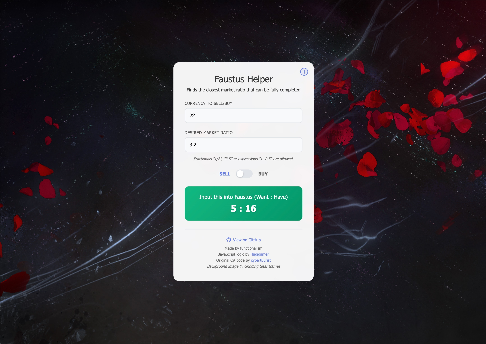
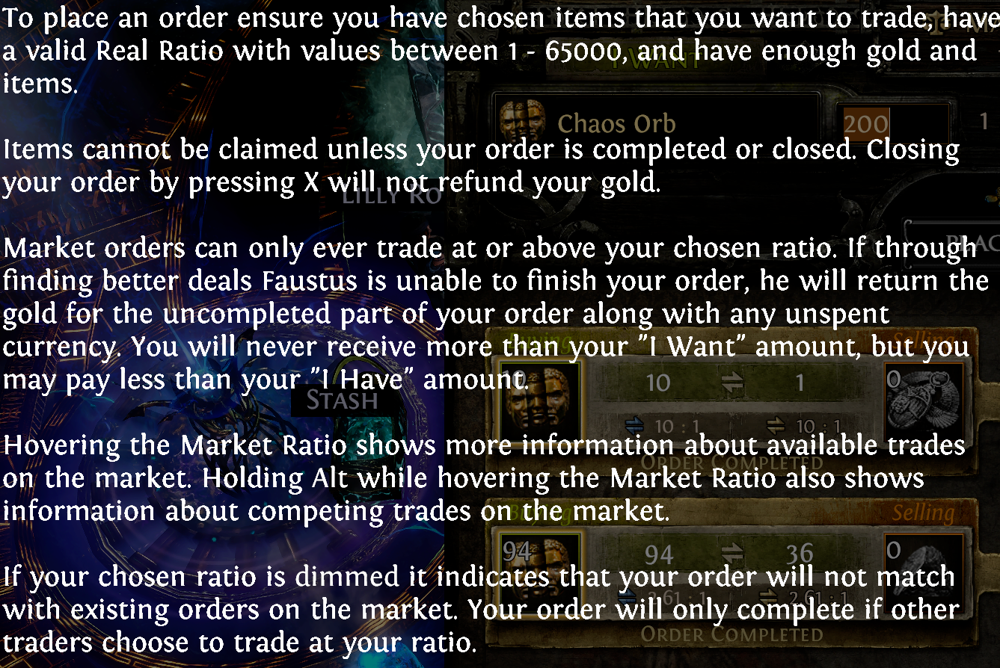
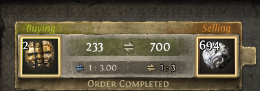
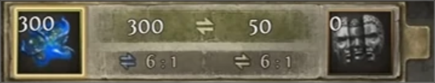

# Faustus Calculator

A modern web-based calculator for Path of Exile's Faustus currency exchange that helps you optimize your trading ratios and avoid partial trades.

## The Problem

When using Path of Exile's Faustus NPC for currency exchange, entering ratios that aren't divisible nicely often results in:

- **Partial trades** - Only part of your currency gets traded, leaving you with leftover amounts
- **Wasted time** - Having to manually calculate optimal ratios that work with Faustus's system

While the game automatically fills out instant buy ratios, you typically want to use competitive rates from previous sales to maximize your
currency. This often requires manual math to find ratios that divide evenly.

## The Solution

This calculator provides an intuitive interface that:

- Takes your currency amount and desired ratio as input
- Automatically calculates the optimal divisible amounts
- Gives you the exact values to enter in Faustus's trade interface
- Ensures your entire order completes successfully without remainders

## Features

- **Real-time calculations** - Results update as you type
- **Flexible ratio input** - Supports decimals (1.5), fractions (3/2), and expressions (1+0.5)
- **Buy/Sell toggle** - Easy switch between buying and selling
- **Clean, modern UI** - Responsive design
- **Instant feedback** - Clear error messages and validation

## How to Use

1. **Enter your currency amount** - The amount you want to trade
2. **Input your desired ratio** - The market rate you want to trade at
3. **Select Buy or Sell** - Use the toggle switch to choose your trade direction
4. **Copy the result** - Use the calculated `A:B` values in-game through Faustus NPC

### Example

If you want to sell 1000 Chaos Orbs at a ratio of 1.33:

- **Input:** `1000` amount, `10` ratio, `SELL` mode
- **Output:** `100:1000` (Faustus NPC in-game, input 100 Divine Orb for "I Want" and 1000 in "I Have")

This ensures no leftover currency and a complete trade.

## 💡 Why This Matters

**Without the calculator:**

**With the calculator:**

## ️ Technical Details

The calculator implements the same algorithm used by the original Faustus Calculator, finding the largest tradeable amount that results in whole
numbers for both currencies.

Built with vanilla HTML, CSS, and JavaScript.

## Credits

- Original C# algorithm by /u/cybert0urist on Reddit
- Original Javascript logic by /u/Hagigamer on Reddit
- [Source Reddit Thread](https://www.reddit.com/r/pathofexile/comments/1lhw36y/thank_you_ggg/)
- Enhanced and modernized for a pleasant UI / UX
- Inspired by the original [Faustus Calculator](https://github.com/Hagigamer/FaustusCalculator) by /u/Hagigamer

---